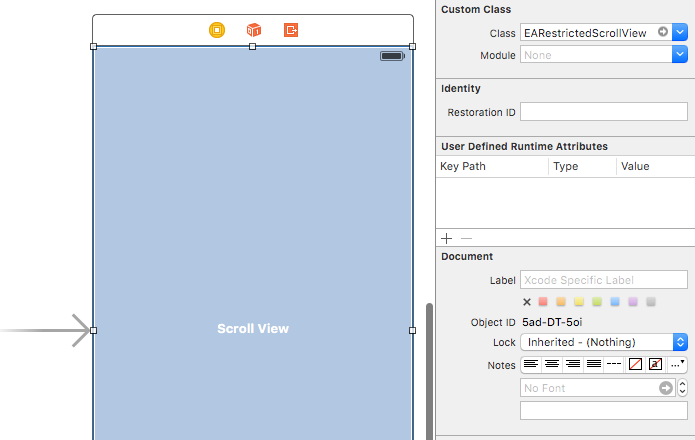

# EARestrictedScrollView

<p align="center">

</p>

<p align="center">

<br>


</p>

## Description

Swift Package 📦 **`UIScrollView` sublass with ability to restrict scrolling area.**

In plain `UIScrollView` only `contentSize` can be changed, but not the origin of scrolling area. This simple and universal solution allows to restrict scrolling area with `CGRect`.

## Installation

Use `Swift Package Manager` to install.

## How To Use It

Can be created from code as usual:

```swift
override func viewDidLoad() {
        super.viewDidLoad()
        
        restrictedScrollView = EARestrictedScrollView(frame: view.bounds)
        restrictedScrollView.alwaysBounceVertical = true
        restrictedScrollView.alwaysBounceHorizontal = true
        view.addSubview(restrictedScrollView)
        
        let imageView = UIImageView(image: UIImage(named: "milky-way"))
        restrictedScrollView.addSubview(imageView)
        restrictedScrollView.contentSize = imageView.frame.size
    }
```

Or from Interface Builder:



Update scrolling area with new `restrictionArea` property. Reset restriction with passing `CGRectZero` to `restrictionArea`.

```swift
func flipSwitch(sender: UISwitch) {
        if sender.on {
            restrictedScrollView.restrictionArea = sender.superview!.frame
        } else {
            restrictedScrollView.restrictionArea = CGRectZero
        }
    }
```

To access subviews use `containedSubviews` property.

```swift
let subviews = restrictedScrollView.containedSubviews
```

## Author

Created and maintained by Evgeny Aleksandrov ([@ealeksandrov](https://twitter.com/ealeksandrov)). Refactored and adapted for use with the `Swift Package Manager` by [Vitalis Gkirsas](https://github.com/epitonium).

## License

`EAIntroView` is distributed under the terms and conditions of the [MIT license](https://github.com/SVProgressHUD/SVProgressHUD/blob/master/LICENSE).
