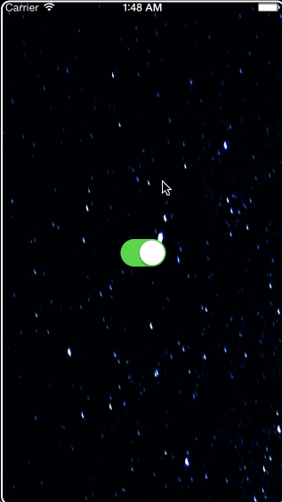

# EARestrictedScrollView

 

## Description

🔸 UIScrollView sublass with ability to restrict scrolling area.
 🔸 Refactored `Swift Package Manager` version of the [EARestrictedScrollView](https://github.com/ealeksandrov/EARestrictedScrollView).

## Installation

Use `Swift Package Manager` to install.

## How To Use It

Read the original [README](https://github.com/ealeksandrov/EARestrictedScrollView/blob/cc642f6196459dd3350e899e427b3dbf0cb3033c/README.md) file.

## Credits

Created and maintained by [ealeksandrov](https://github.com/ealeksandrov). Refactored and adapted for use with the `Swift Package Manager` by [epitonium](https://github.com/epitonium).

## License

`EARestrictedScrollView` is distributed under the terms and conditions of the [LICENSE](https://github.com/ealeksandrov/EARestrictedScrollView/blob/cc642f6196459dd3350e899e427b3dbf0cb3033c/LICENSE.md).
